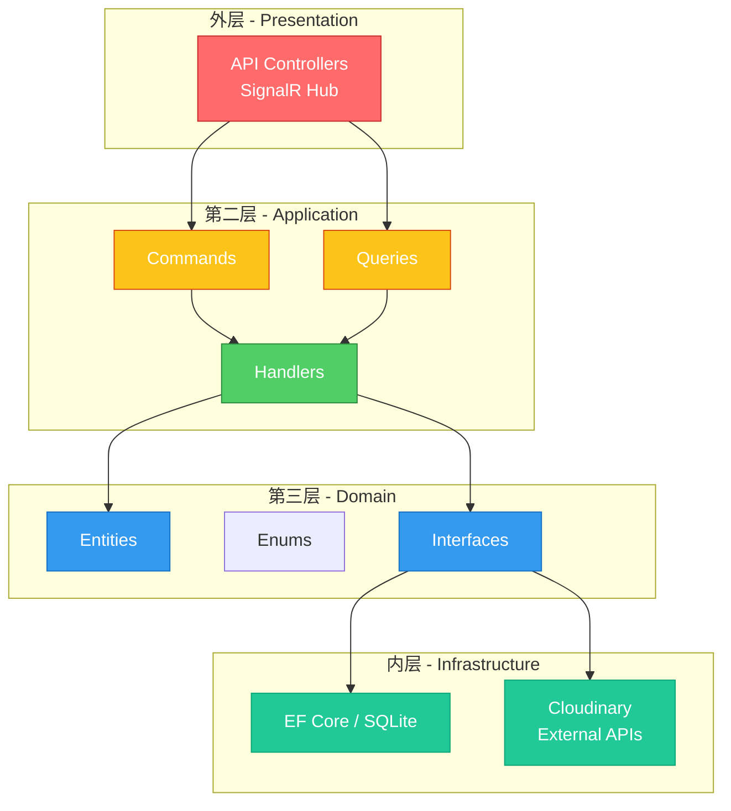
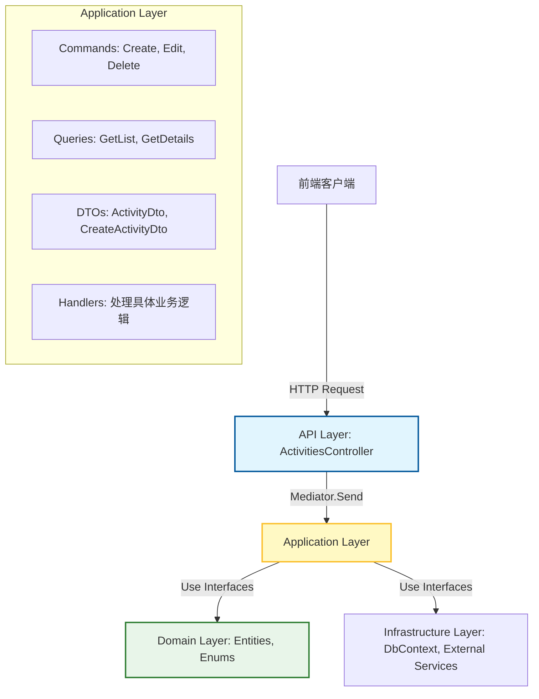

# .NET 8 Web API 项目技术分析报告

## 项目概况

本项目 `react-net-activity` 是一个典型的 **Clean Architecture** 架构的 Web API 项目，采用 .NET 8 框架构建，并实施了 **CQRS (命令查询职责分离)** 模式。核心通信机制依赖 **MediatR库** 实现中介者模式，旨在解耦 API 层与业务逻辑层。

---

## 一、项目技术栈概览

### 1.1 项目结构（Clean Architecture）

```
react-net-activity/
├── API/              # 表现层 - Web API 入口
├── Application/      # 应用层 - 业务逻辑
├── Domain/           # 领域层 - 实体定义
├── Infrastructure/   # 基础设施层 - 外部服务
└── Persistence/      # 持久层 - 数据库访问
```

### 1.2 Clean Architecture 标准模型

Clean Architecture（也称洋葱架构）是一种标准的软件架构模式，核心原则是**依赖方向指向内核**，外层依赖内层，内层对外层无感知。


> 图 1：Clean Architecture 标准模型（来源：Robert C. Martin）

### 1.3 本项目架构映射

| 标准 Clean Architecture 层 | 本项目对应模块 | 职责 |
|---------------------------|---------------|------|
| **Presentation / Interface** | `API/` | HTTP 控制器、SignalR Hub、Middleware |
| **Application / Use Cases** | `Application/` | Command/Query Handler、业务流程编排 |
| **Domain / Enterprise Business Rules** | `Domain/` | 实体、枚举、领域事件、接口定义 |
| **Infrastructure / Frameworks** | `Infrastructure/` + `Persistence/` | 数据库实现、外部服务、文件存储 |



> 图 2：本项目 Clean Architecture 架构图

### 1.4 依赖规则说明

Clean Architecture 的核心依赖规则：

1. **源代码依赖只能指向内核**：API 引用 Application，Application 引用 Domain，但 Domain 不引用任何外层
2. **内层定义接口，外层实现接口**：如 Domain 定义 `IActivityRepository`，由 Persistence 层实现
3. **内层对外层无感知**：Domain 层不知道有 HTTP、数据库、云存储的存在

### 1.2 核心技术组件

| 层级 | 技术选型 | 版本 |
|------|---------|------|
| 运行时 | .NET | 8.0 |
| Web 框架 | ASP.NET Core | 内置 |
| ORM | Entity Framework Core | 8.0.23 |
| 数据库 | SQLite | - |
| 依赖注入 | MediatR | 14.0.0 |
| 验证 | FluentValidation | 12.1.1 |
| 对象映射 | AutoMapper | 16.0.0 |
| 身份认证 | ASP.NET Core Identity | 8.0.23 |
| 实时通信 | SignalR | 内置 |
| API 文档 | Swagger (Swashbuckle) | 6.6.2 |
| 外部服务 | Cloudinary | 1.28.0 |

---

## 二、架构设计详解

### 2.1 CQRS + Mediator 模式实现

以 [`ActivitiesController`](file://d:\02Codes\react-net-activity\API\Controllers\ActivitiesController.cs#L11-L55) 为例，展示系统的分层引用关系：

#### 数据流向图



#### 关键代码元素解析

**1. 控制器层 (`API.Controllers`)**
- [`ActivitiesController`](file://d:\02Codes\react-net-activity\API\Controllers\ActivitiesController.cs#L9-L52): 继承自 [`BaseApiController`](file://d:\02Codes\react-net-activity\API\Controllers\BaseApiController.cs)
- **职责**: 仅负责接收 HTTP 请求、参数绑定、调用 [`Mediator`](file://d:\02Codes\react-net-activity\API\Controllers\BaseApiController.cs#L12-L14) 发送消息，并通过 [`HandleResult`](file://d:\02Codes\react-net-activity\API\Controllers\BaseApiController.cs#L16-L22) 统一格式化响应
- **特点**: 无业务逻辑，极度轻量

**2. 应用层 (`Application`)**
- **Commands**: 如 `CreateActivity.Command`, `EditActivity.Command`。封装写操作的意图和数据
- **Queries**: 如 `GetActivityList.Query`, `GetActivityDetails.Query`。封装读操作的意图
- **DTOs**: 如 [`ActivityDto`](file://d:\02Codes\react-net-activity\Application\Activities\DTOs\ActivityDto.cs), [`CreateActivityDto`](file://d:\02Codes\react-net-activity\Application\Activities\DTOs\CreateActivityDto.cs)。作为 API 边界的数据契约，隔离领域模型

**3. 基础设施与基类**
- [`BaseApiController`](file://d:\02Codes\react-net-activity\API\Controllers\BaseApiController.cs): 提供了 [`Mediator`](file://d:\02Codes\react-net-activity\API\Controllers\BaseApiController.cs#L12-L14) 实例和 [`HandleResult`](file://d:\02Codes\react-net-activity\API\Controllers\BaseApiController.cs#L16-L22) 方法
- [`HandleResult`](file://d:\02Codes\react-net-activity\API\Controllers\BaseApiController.cs#L16-L22): 核心辅助方法，将 Application 层返回的 `Result<T>` 对象转换为 ASP.NET Core 的 `ActionResult`(如 200 OK, 400 Bad Request, 404 Not Found)

### 2.2 权限控制策略

使用声明式授权策略：
```csharp
[Authorize(Policy = "IsActivityHost")]
public async Task<ActionResult> EditActivity(string id, EditActivityDto activityDto)
```

这种设计将"谁可以执行操作"的逻辑从业务代码中剥离，交由 ASP.NET Core 的授权中间件处理，安全性更高且易于审计。

---

## 三、.NET 8 Web API 优势分析

### 2.1 性能优势

**✅ 高性能**
- .NET 8 相比 .NET 6/7 有 10-20% 的性能提升
- 启用了 `Tiered Compilation` 和 `ReadyToRun`，启动更快
- Kestrel 服务器性能优异

**✅ 低内存占用**
- Source Generator 减少运行时反射开销
- 更好的 GC 垃圾回收优化

### 2.2 开发效率优势

**✅ 现代语言特性**
```csharp
// 记录类型 (Record)
public record ActivityDto(Guid Id, string Title, DateTime Date);

// 空引用类型安全 (Nullable Reference Types)
public string? GetName() { }  // 明确标注可空

// 模式匹配
return person switch {
    { Age: < 18 } => "未成年",
    { Age: >= 65 } => "老年人",
    _ => "成年人"
};
```

**✅ 依赖注入原生支持**
```csharp
// 原生 DI 容器，无需第三方框架
builder.Services.AddScoped<IService, Service>();
builder.Services.AddSingleton<ISingleton, Singleton>();
```

**✅ Minimal API 支持**
```csharp
// 简洁的 API 定义
app.MapGet("/activities", async (AppDbContext ctx) => 
    await ctx.Activities.ToListAsync());
```

### 2.3 架构优势

**✅ 完善的中间件管道**
```csharp
// 自定义中间件示例
app.UseMiddleware<ExceptionMiddleware>();
app.UseRouting();
app.UseAuthentication();
app.UseAuthorization();
```

**✅ 信号R实时通信**
```csharp
// 集成 SignalR 支持实时推送
app.MapHub<CommnetHub>("/comments");
```

**✅ 内置身份认证**
```csharp
// 完整的 Identity 支持
builder.Services.AddIdentityApiEndpoints<User>()
    .AddRoles<IdentityRole>()
    .AddEntityFrameworkStores<AppDbContext>();
```

### 2.4 生态系统优势

**✅ 丰富的 NuGet 包**
- MediatR (CQRS)
- FluentValidation (验证)
- AutoMapper (映射)
- Cloudinary (云存储)

**✅ 跨平台部署**
- Windows、Linux、macOS 均可运行
- 支持 Docker 容器化
- 支持 Kubernetes 部署

---

## 四、当前架构优势总结

基于 CQRS + Mediator 的实现，本项目的核心优势包括：

### 4.1 高内聚低耦合 (Loose Coupling)
- Controller 不直接依赖 Service 或 Repository，而是依赖 `IMediator`
- 更换底层实现(如从 EF Core 切换到 Dapper)无需修改 Controller 代码

### 4.2 单一职责原则 (SRP)
- 每个 Command/Query 都有独立的 Handler
- 例如，[`CreateActivity`](file://d:\02Codes\react-net-activity\API\Controllers\ActivitiesController.cs#L25-L32) 的逻辑完全独立于 [`GetActivity`](file://d:\02Codes\react-net-activity\API\Controllers\ActivitiesController.cs#L20-L24)，便于单独进行单元测试

### 4.3 一致的错误处理
- 通过 [`HandleResult`](file://d:\02Codes\react-net-activity\API\Controllers\BaseApiController.cs#L16-L22) 统一处理业务异常
- 确保前端接收到的错误格式一致(例如 `{ "errors": {...} }`)

### 4.4 细粒度权限控制
- 使用 `[Authorize(Policy = "IsActivityHost")]`
- 将权限规则从业务代码中剥离，交由授权中间件处理

### 4.5 易于横向扩展
- CQRS 允许对读模型和写模型进行独立优化
- 例如，[`GetActivities`](file://d:\02Codes\react-net-activity\API\Controllers\ActivitiesController.cs#L13-L18) 可以后续优化为从 Redis 缓存或只读副本读取，而不影响写入逻辑

---

## 五、企业级 Web API 改进建议

### 5.1 输入验证 (Validation) ⭐⭐⭐

**现状**: 控制器直接接收 DTO 并发送给 Mediator

**问题**: 如果验证逻辑放在 Handler 中，会导致 Handler 臃肿；如果放在 Controller 中，违背了薄控制器原则

**建议**: 
- 引入 **FluentValidation** 库(项目已安装)
- 为每个 Command/DTO 创建对应的 `Validator`(如 [`CreateActivityValidator`](file://d:\02Codes\react-net-activity\Application\Activities\Validators\CreateActivityValidator.cs))
- 注册 MediatR 的 [`ValidationBehavior`](file://d:\02Codes\react-net-activity\Application\Core\ValidationBehavior.cs#L8-L28) 管道行为
- **效果**: 请求在进入 Handler 之前自动被验证，无效请求直接返回 400

### 5.2 分页与性能 (Pagination) ⭐⭐⭐

**现状**: [`GetActivities`](file://d:\02Codes\react-net-activity\API\Controllers\ActivitiesController.cs#L13-L18) 返回 `List<ActivityDto>`

**问题**: 当活动数量巨大时，一次性加载所有数据会导致内存溢出和网络延迟

**建议**:
- 修改 `GetActivityList.Query` 支持分页参数 (`PageNumber`, `PageSize`)
- 返回类型改为 `PagedList<ActivityDto>` 或包含元数据的包装对象
- 在 Query Handler 中使用 EF Core 的 `.Skip().Take()` 或 SQL 分页

### 5.3 并发控制 (Concurrency) ⭐⭐

**现状**: [`EditActivity`](file://d:\02Codes\react-net-activity\API\Controllers\ActivitiesController.cs#L34-L42) 和 [`DeleteActivity`](file://d:\02Codes\react-net-activity\API\Controllers\ActivitiesController.cs#L44-L49) 仅依赖 ID

**问题**: 多人同时编辑同一活动可能导致数据覆盖(Lost Update)

**建议**:
- 在 [`EditActivityDto`](file://d:\02Codes\react-net-activity\Application\Activities\DTOs\EditActivityDto.cs#L2-L5) 或 Command 中加入 `RowVersion` 或 `ETag`
- 在 EF Core 中配置并发令牌
- 在更新时检查版本号，若不一致则抛出 `DbUpdateConcurrencyException` 并返回 409 Conflict

### 5.4 API 版本控制 (Versioning) ⭐⭐

**现状**: 路径为 `/api/activities`

**问题**: 未来修改 DTO 结构或业务逻辑时，可能破坏现有客户端

**建议**: 
- 引入 `Asp.Versioning.Http` 库
- 配置 URL 路径版本控制 (e.g., `/api/v1/activities`)
- 确保向后兼容性

### 5.5 日志与监控 (Observability) ⭐⭐⭐

**现状**: 未见显式日志记录

**建议**:
- 在 MediatR 中创建自定义 `PipelineBehavior` (如 `LoggingBehavior`)
- 自动记录每个 Command/Query 的开始时间、结束时间、耗时及异常信息
- 集成 Serilog + Seq/Application Insights 进行结构化日志存储

### 5.6 软删除 (Soft Delete) ⭐⭐

**现状**: [`DeleteActivity`](file://d:\02Codes\react-net-activity\API\Controllers\ActivitiesController.cs#L44-L49) 语义上可能是物理删除

**建议**:
- 在 [`Domain.Activity`](file://d:\02Codes\react-net-activity\Domain\Activity.cs#L5-L24) 实体中添加 `IsDeleted` 字段和 `DeletedAt` 时间戳
- 在 EF Core 全局查询过滤器中自动过滤已删除数据
- 确保"活动主持人"删除活动后，历史报名记录仍可追溯

### 5.7 其他安全性增强

| 当前状态 | 改进建议 | 优先级 |
|---------|---------|--------|
| 使用 Identity | 考虑 JWT Bearer 令牌认证，适配 SPA | ⭐⭐⭐ |
| CORS 策略较简单 | 限制特定域名，而非 `AllowAnyOrigin` | ⭐⭐⭐ |
| 无 API 限流 | 添加 Rate Limiting 防止恶意请求 | ⭐⭐ |
| 无请求日志审计 | 集成 Serilog 记录请求/响应详情 | ⭐⭐ |
| 明文配置风险 | 使用 Azure Key Vault / SQL 加密存储密钥 | ⭐⭐ |

### 5.8 其他性能优化

| 改进项 | 说明 | 优先级 |
|-------|------|-------|
| **缓存层** | 引入 Redis 缓存热点数据，降低数据库压力 | ⭐⭐⭐ |
| **Response Caching** | 添加 OutputCache 减少重复计算 | ⭐⭐ |
| **连接池** | SQLite 换成 PostgreSQL/MySQL 生产级数据库 | ⭐⭐⭐ |
| **N+1 查询** | 使用 Include/Eager Loading 优化 | ⭐⭐ |

### 5.9 可观测性增强

| 改进项 | 说明 | 优先级 |
|-------|------|-------|
| **Structured Logging** | 使用 Serilog 替代 Console.WriteLine | ⭐⭐⭐ |
| **健康检查** | 添加 HealthCheck 端点，监控服务状态 | ⭐⭐ |
| **指标收集** | 集成 Prometheus + Grafana 监控 | ⭐⭐ |
| **分布式追踪** | 使用 OpenTelemetry 追踪请求链路 | ⭐⭐ |
| **异常监控** | 集成 Sentry/Application Insights | ⭐⭐ |

### 5.10 架构优化

| 改进项 | 说明 | 优先级 |
|-------|------|-------|
| **Dapper 混合使用** | EF Core 用于 CRUD，Dapper 用于复杂查询 | ⭐⭐ |
| **审计日志** | 记录用户操作历史(谁、何时、做了什么) | ⭐⭐ |
| **CQRS 深化** | 读写分离，更好的扩展性 | ⭐⭐ |

### 5.11 DevOps & 部署

| 改进项 | 说明 | 优先级 |
|-------|------|-------|
| **Docker 容器化** | 编写 Dockerfile，标准化部署 | ⭐⭐⭐ |
| **CI/CD** | 集成 GitHub Actions / Azure DevOps | ⭐⭐⭐ |
| **配置分层** | development/staging/production 配置分离 | ⭐⭐ |
| **健康检查** | Kubernetes liveness/readiness 探针 | ⭐⭐ |
| **滚动更新** | 支持零 downtime 部署 | ⭐⭐ |

### 5.12 测试

| 改进项 | 说明 | 优先级 |
|-------|------|-------|
| **单元测试** | xUnit + FluentAssertions + Moq | ⭐⭐⭐ |
| **集成测试** | Testcontainers 集成测试数据库 | ⭐⭐⭐ |
| **E2E 测试** | Playwright / Cypress 端到端测试 | ⭐⭐ |
| **API 契约测试** | Pact 消费者驱动契约测试 | ⭐⭐ |

### 3.1 安全性增强

| 当前状态 | 改进建议 | 优先级 |
|---------|---------|--------|
| 使用 Identity | 考虑 JWT Bearer 令牌认证，适配 SPA | ⭐⭐⭐ |
| CORS 策略较简单 | 限制特定域名，而非 `AllowAnyOrigin` | ⭐⭐⭐ |
| 无 API 限流 | 添加 Rate Limiting 防止恶意请求 | ⭐⭐ |
| 无请求日志审计 | 集成 Serilog 记录请求/响应详情 | ⭐⭐ |
| 明文配置风险 | 使用 Azure Key Vault / SQL 加密存储密钥 | ⭐⭐ |

### 3.2 性能优化

| 改进项 | 说明 | 优先级 |
|-------|------|-------|
| **缓存层** | 引入 Redis 缓存热点数据，降低数据库压力 | ⭐⭐⭐ |
| **Response Caching** | 添加 OutputCache 减少重复计算 | ⭐⭐ |
| **连接池** | SQLite 换成 PostgreSQL/MySQL 生产级数据库 | ⭐⭐⭐ |
| **分页** | List 接口添加分页支持，避免大结果集 | ⭐⭐⭐ |
| **N+1 查询** | 使用 Include/Eager Loading 优化 | ⭐⭐ |

### 3.3 可观测性

| 改进项 | 说明 | 优先级 |
|-------|------|-------|
| **Structured Logging** | 使用 Serilog 替代 Console.WriteLine | ⭐⭐⭐ |
| **健康检查** | 添加 HealthCheck 端点，监控服务状态 | ⭐⭐ |
| **指标收集** | 集成 Prometheus + Grafana 监控 | ⭐⭐ |
| **分布式追踪** | 使用 OpenTelemetry 追踪请求链路 | ⭐⭐ |
| **异常监控** | 集成 Sentry/Application Insights | ⭐⭐ |

### 3.4 架构优化

| 改进项 | 说明 | 优先级 |
|-------|------|-------|
| **Dapper 混合使用** | EF Core 用于 CRUD，Dapper 用于复杂查询 | ⭐⭐ |
| **审计日志** | 记录用户操作历史（谁、何时、做了什么） | ⭐⭐ |
| **CQRS 深化** | 读写分离，更好的扩展性 | ⭐⭐ |
| **API 版本控制** | 添加 v1/v2 版本控制，兼容旧客户端 | ⭐⭐ |
| **API 聚合** | 使用 GraphQL 或 BFF 模式 | ⭐ |

### 3.5 DevOps & 部署

| 改进项 | 说明 | 优先级 |
|-------|------|-------|
| **Docker 容器化** | 编写 Dockerfile，标准化部署 | ⭐⭐⭐ |
| **CI/CD** | 集成 GitHub Actions / Azure DevOps | ⭐⭐⭐ |
| **配置分层** | development/staging/production 配置分离 | ⭐⭐ |
| **健康检查** | Kubernetes liveness/readiness 探针 | ⭐⭐ |
| **滚动更新** | 支持零 downtime 部署 | ⭐⭐ |

### 3.6 测试

| 改进项 | 说明 | 优先级 |
|-------|------|-------|
| **单元测试** | xUnit + FluentAssertions + Moq | ⭐⭐⭐ |
| **集成测试** | Testcontainers 集成测试数据库 | ⭐⭐⭐ |
| **E2E 测试** | Playwright / Cypress 端到端测试 | ⭐⭐ |
| **API 契约测试** | Pact 消费者驱动契约测试 | ⭐⭐ |

---

## 六、改进优先级建议

### 第一阶段（立即处理）
1. ✅ 完善 FluentValidation 验证器集成(项目已有基础)
2. 替换 SQLite 为 PostgreSQL/MySQL（生产级数据库）
3. 添加 JWT 认证支持（更适配 SPA）
4. 添加日志框架（Serilog）
5. 完善 CORS 策略（限制域名）
6. 添加基础单元测试

### 第二阶段（短期）
1. 实现分页接口
2. 引入 Redis 缓存
3. 添加健康检查端点
4. 添加 API 版本控制
5. 编写 Dockerfile

### 第三阶段（中期）
1. 完善监控系统
2. 添加集成测试
3. 审计日志
4. 并发控制
5. 软删除机制
6. 性能优化

---

## 七、总结

当前项目采用了现代的 **Clean Architecture** 设计，.NET 8 + MediatR + EF Core + CQRS 的组合在中小型项目中非常高效。优势包括：

- ✅ **高性能**：.NET 8 带来显著性能提升
- ✅ **开箱即用**：身份认证、SignalR、Swagger 完美集成
- ✅ **工程化**：分层架构清晰，易于维护
- ✅ **现代化**：C# 12 新特性，源代码生成器
- ✅ **可扩展**：CQRS 模式便于独立优化读写模型
- ✅ **可测试**：薄控制器 + 独立 Handler 便于单元测试

作为企业级应用，建议从**安全性**(验证、JWT)、**可观测性**(日志、监控)、**性能**(分页、缓存、数据库升级)、**测试**四个维度优先改进，以满足生产环境的要求。